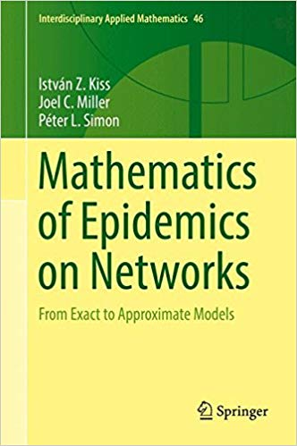
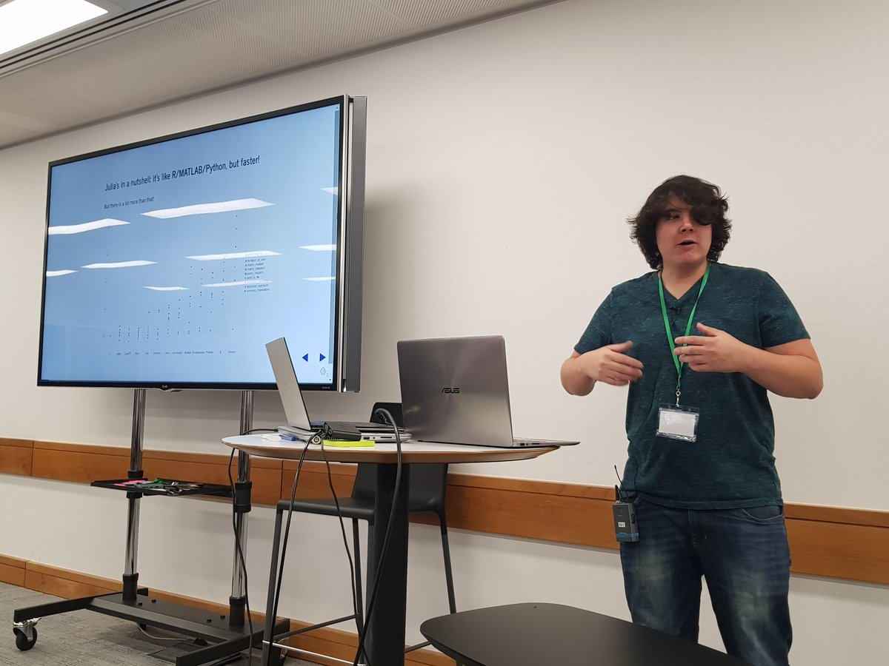
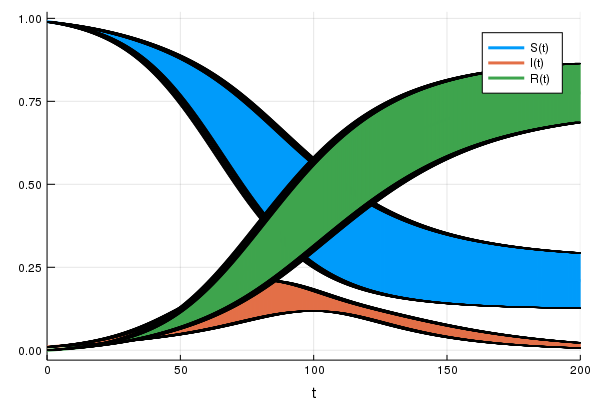

---
title:
output:
  revealjs::revealjs_presentation:
    theme: simple
    css: styles.css
    self_contained: false
    mathjax: local
    #reveal_plugins: ["zoom","chalkboard"]
always_allow_html: yes
---

```{r setup, include=FALSE}
knitr::opts_chunk$set(echo = FALSE)
knitr::opts_chunk$set(fig.align='center')
knitr::opts_chunk$set(fig.width=7)
knitr::opts_chunk$set(fig.height=5)
knitr::opts_chunk$set(out.extra='border:0px;')
suppressPackageStartupMessages(library(ggplot2))
```

## {data-background=#d3d3d3}

<h2 style="color:#0047AB">Epirecipes: developing a cookbook of epidemiological models</h2>
<h2 style="color:#000000">Simon Frost</h2>
<br>


## Acknowledgements

<div class="left">

- Facilitators
    - Zhian Kamvar
    - Chris Rackauckas
    - Rich FitzJohn
    - Thibaut Jombart
    - James Lester
    - Gerry Tonkin-Hill
    
</div>

<div class="right">

- Cambridge
    - Dr. Allyson Walsh
    - Dr. Lydia Drumright
    - Prof. James Wood
- ATI
    - Jade Thompson
- All the participants of the 2018 meeting

</div>

## Sponsors

<div class="left">

<center>

<br>

<br>

<br>

</center>
</div>
<div class="right">
<center>

<br>

<br>

</center>
</div>

## Introduction

- Mathematical models of infectious disease transmission are widely used in research, policy-making etc.
- Field is becoming increasing computational
    - Simple to complex models
    - Analytical to simulation
    - Deterministic to stochastic
- Relatively inexpensive
    - Well suited for junior researchers
    - Allows contributions from resource-limited settings
- Need capacity building and skill development

## Efforts to increase capacity in disease modeling fall short

- Training resources focus on the same, basic building blocks
- Published models are often not 'open'
    - Model building process is hidden
    - Details and/or implementation may not be available
    - No central resource - models are difficult to discover
- Models are often restricted to a single computer language
    - May/may not be the best choice
    - Limits extending models by others
- Not 'plug and play'
    - May involve installing an extensive toolchain

## Keeling and Rohani (2007)

<div class="left">


</div>

<div class="right">
- Good selection of conceptual models
- Examples mainly in C/C++ and Fortran
    - Some in Python

</div>

## Vynnycky and White (2010)

<div class="left">


</div>

<div class="right">

- Focuses on introductory models
- Examples in MS Excel and Berkeley Madonna

</div>


## Martcheva (2015)

<div class="left">


</div>

<div class="right">

- Some examples in Matlab

</div>

## Kiss, Miller & Simon (2017)

<div class="left">



</div>

<div class="right">

- Focuses on network models
- Dedicated library 'Epidemics on Networks' in Python

</div>

## Li (2018)

<div class="left">


</div>

<div class="right">

- Only contains a single example of code for parameter estimation in Matlab

</div>

## Courses

- There are a number of excellent courses in disease modeling in the UK alone:
    - Imperial
    - Cambridge
    - LSHTM
- Material is often closed
- Typically adopt a single language for practicals

## Summary

- Courses and textbooks are limited in their use of examples:
    - Number
    - Diversity
    - Implementation
        - Access
        - Language
- Publications present 'state of the art' models, but may not have an implementation, especially if not recent
- Implementations in commercial packages are not truly 'open'

## Barriers to open models

- High cost of commercial packages
    - Matlab: >£200/yr
    - Mathematica: c. £1000/yr
    - Berkeley Madonna: > £200
        - Solution: only use free, open source languages
- Slow internet speeds make installation of toolchains difficult
    - Exacerbated by the need to accommodate multiple languages
        - Solution: package all tools together in a format that could be used offline

## Aims

- To complement existing resources by developing an online 'cookbook' of epidemiological models
- Objectives for models
    - Illustrate different diseases, 'tricks', etc.
    - Open source
    - Implemented in multiple (free) computer languages
    - Can be run via a web browser

## What is Epirecipes?

- An *initiative* to collate implementations of mathematical models of infectious disease transmission
- A *platform* to allow these models to be run reproducibly
- An online, interactive *cookbook* that provides background, references, search capacity etc.
- A *community* of researchers to contribute to the resource
- *Hackathons* to build momentum in developing material in key areas

## The platform

<br>


<br>


<br>


## Features of the platform

- Portable: runs on Windows, Mac, and Linux
- Easy to set up a new server
- Can run the platform on a laptop with a small script

## Languages in Epirecipes base container to date

- Interpreted languages
    - Python, R, Julia, Octave, Scilab, Javascript
- Compiled languages
    - C, Fortran, C++
- Computer algebra systems
    - Maxima, Pari-GP
- Tools
    - XPP-AUT, VF-GEN, LibBi, Gnuplot

## Epirecipes packages

- Python
    - scipy, pydstool, PyGOM, SimPy, salabim
- R
    - deSolve, dde, odin, GillespieSSA, POMP, rbi
- Julia
    - DifferentialEquations, Gillespie
- Node
    - ode-rk4
- C++
    - Boost::odeint

## SIR model

- Let's take the standard 'susceptible-infected-recovered' model

$$
\frac{dS(t)}{dt}  = -\beta S(t) I(t)\\
\frac{dI(t)}{dt}  = \beta S(t) I(t)- \gamma I(t)\\
\frac{dR(t)}{dt}  = \gamma I(t)
$$

## R vs Python

<div>

<div class="left">

```{r,echo=TRUE,eval=FALSE}
sir_ode <- function(times,init,parms){
  with(as.list(c(parms,init)), {
  # ODEs
  dS <- -beta*S*I
  dI <- beta*S*I-gamma*I
  dR <- gamma*I
  list(c(dS,dI,dR))
  })
}
parms <- c(beta=0.1,gamma=0.05)
init <- c(S=0.99,I=0.01,R=0) 
times <- seq(0,200,length.out=2001)
sir_out <- lsoda(init,
                 times,
                 sir_ode,
                 parms)
```

</div>

<div class="right">

```{python,echo=TRUE,eval=FALSE}
def sir_ode(times,init,parms):
    b, g = parms
    S,I,R = init
    # ODEs
    dS = -b*S*I
    dI = b*S*I-g*I
    dR = g*I
    return [dS,dI,dR]
parms = [0.1,0.05]
init = [0.99,0.01,0]
times = np.linspace(0,200,2001)
sir_sol = solve_ivp(
    fun=lambda t, y: sir_ode(t, y, parms),
    t_span=[min(times),max(times)],
    y0=init,
    t_eval=times)
```

</div>

</div>

## Why different languages?

- If the differences in syntax are relatively minor, why consider other languages?
- Some are better suited for some tasks than others
    - Loops
    - The 'two language' problem
- Differences in the ecosystem
- You should code in what you like, but it may be necessary to 'read' other languages
- Interoperability is actually quite good
    - R: reticulate, JuliaCall, XRpython, XRjulia

## Hackathons

- Recently held an Epirecipes meeting at The Alan Turing Institute
- Primary aim: implement as many models as possible
    - A brief description of the model
        - Ideally with equations and links
    - A reference implementation in your favourite language
        - Ideally with graphical output (if appropriate), a test, and a benchmark
- Secondary aim: capacity and team building
    - Provide training sessions
    - To provide access to individuals from low-to-middle income countries

## Attendance

- 45 participants
- 60% graduate students, 25% postdocs
- 50% female
- 10% from low to middle income countries 

## Training sessions




## Julia 

- Relatively new language for technical computing
- 'Combining the high-level productivity and ease of use of Python and R with the lightning-fast speed of C++' - Alan Edelman
- Well suited for simulation and inference:
    - Just-in-time compiled
    - Interactive
    - Expanding ecosystem for modeling, Markov chain Monte Carlo, machine learning etc.

## Benchmarking of a simple discrete-time SIR model

$$
S(t+\delta t) = S(t)-x \\
I(t+\delta t) = I(t)+x-y \\
R(t+\delta t) = R(t)+y \\
x \tilde \rm{binomial}(S,1-e^{-\lambda \delta t}) \\
y \tilde \rm{binomial}(I,1-e^{-\gamma \delta t}) \\
\lambda = \frac{\beta(I+\iota)}{S+I+R}
$$

## R code

```{r,echo=TRUE,eval=FALSE}
sir <- function(t,u,parms){
  with(c(u,parms),{
    lambd <- bet*(I + iota)/N
    ifrac <- 1.0 - exp(-lambd*dt)
    rfrac <- 1.0 - exp(-gamm*dt)
    infection <- rbinom(1,S,ifrac)
    recovery <- rbinom(1,I,rfrac)
    return(list(S=S-infection,
                I=I+infection-recovery,
                R=R+recovery,
                Y=Y+infection))
  })
}
```

- Time for 1000 replicates: 7.5s

## Python code

```{python,echo=TRUE,eval=FALSE}
def sir(t,u,parms):
    bet,gamm,iota,N,dt=parms
    S,I,R,Y=u
    lambd = bet*(I+iota)/N
    ifrac = 1.0 - math.exp(-lambd*dt)
    rfrac = 1.0 - math.exp(-gamm*dt)
    infection = np.random.binomial(S,ifrac)
    recovery = np.random.binomial(I,rfrac)
    return [S-infection,
            I+infection-recovery,
            R+recovery,
            Y+infection]
```

- Time: 1.8s

## Julia code

```julia
@inline @fastmath function sir(t, u, parms, rng)
    (S, I, R, Y) = u
    (β, γ, ι, N, δt) = parms
    λ = β * (I + ι) / N
    ifrac = 1.0 - exp(-λ * δt)
    rfrac = 1.0 - exp(-γ * δt)
    infection = randbn(S, ifrac, rng)
    recovery = randbn(I, rfrac, rng)
    return (S - infection,
            I + infection - recovery,
            R + recovery,
            Y + infection)
end
```

- Time: 0.03s

## DifferentialEquations.jl

- DifferentialEquations.jl is the core differential equation solver package in Julia, with solvers for:
  - ODEs
  - DAEs
  - SODEs, SDAEs
  - Discrete stochastic (Gillespie) equations, mixed with ODEs/SDEs (jump diffusions)
  - DDEs
  - PDEs
- Wrappers to common C++ and Fortran libraries plus native Julia implementations
- See [https://github.com/ChrisRackauckas/JuliaAndDiffEq](https://github.com/ChrisRackauckas/JuliaAndDiffEq)

## SIR example

```
sir_ode = @ode_def SIRModel begin
    dS = -β*S*I
    dI = β*S*I-γ*I
    dR = γ*I
end β γ
parms = [0.1,0.05]
init = [0.99,0.01,0.0]
tspan = (0.0,200.0)
sir_prob = ODEProblem(sir_ode,
                      init,
                      tspan,
                      parms)
sir_sol = solve(sir_prob,saveat=0.1)
```

## Automated plotting

```
plot(sir_sol)
```

{width="60%"}

## Adding uncertainty

```
parms2 = [0.1 ± 0.01,0.05 ± 0.005]
init2 = [0.99 ± 0.0,0.01 ± 0.0 ,0.0 ± 0.0]
```

{width="60%"}

## Models implemented

- 'Bring your own model'
- Textbooks
- Literature search
- 'Shopping list' at https://github.com/epirecipes/shopping-list/issues

## Concepts targeted in first meeting

- Deterministic models
- Stochastic (demographic/environmental) models
- Age structured models
- Spatial models
- Network models (edge-based, pair approx.)
- Non-exponential passage times
- Disease-specific models

## Final outcomes

- Incorporation of notebooks into https://epirecip.es/epicookbook
    - Licensing:
        - MIT (code)
        - Creative Commons CC-BY 4.0 (text)
- Group publication:
    - Journal of Open Source Education
    - F1000 Research

## http://epirecip.es/epicookbook

- The cookbook is a 'Jupyter Book', originally created by Sam Lau and Chris Holdgraf with support of the UC Berkeley Data Science Education Program and the Berkeley Institute for Data Science

<br>

<large>

- [To the cookbook!](http://epirecip.es/epicookbook)

</large>

## Javascript and Observable Notebooks

- Javascript forms the cornerstone of web-based visualisations
- Can be fiddly to code:
    - Multiple languages to deal with (JS, HTML, CSS)
    - Asynchronous code
- Observable notebooks offer one solution
    - Reactive programming
    - Community
    - Web platform
- Notebooks are exported as web pages and included in the main cookbook

<large>

[To the Observable notebook collection](https://beta.observablehq.com/@epichef?tab=collections)

</large>

## How you can help

- Post an issue on `epirecipes/shopping-list`
- Port an existing model
- Add your own model
- Use Epirecipes in teaching/training

{width="50%"}

## Next steps

- First release of the cookbook
    - Provide a Digital Object Identifier for citation purposes
- Future hackathons
    - More of the same
    - Agent based models/discrete event simulations
    - Inference
- More scalable backend

## Conclusions

- After only a single hackathon, Epirecipes already contains a wide range of models in a variety of languages
- Much to be done!
    - Growing the community

## Try for yourself

- Main website:
    - [http://epirecip.es](http://epirecip.es)
- Cookbook:
    - [http://epirecip.es/epicookbook](http://epirecip.es/epicookbook)
- Observable:
    - [https://beta.observablehq.com/@epichef](https://beta.observablehq.com/@epichef)
- GitHub Repository:
    - [https://github.com/epirecipes/epicookbook](http://github.com/epirecipes/epicookbook)

## Thanks!


<h2>
<span style="font-size:24px"> &nbsp;<a href="mailto:sdwfrost@gmail.com" target="_blank" style="vertical-align:middle">sdwfrost@gmail.com</a></span>
<span style="font-size:24px"> &nbsp;<a href="http://www.twitter.com/sdwfrost" target="_blank" style="vertical-align:middle">@sdwfrost</a></span>
<span style="font-size:24px"> &nbsp;<a href="http://github.com/sdwfrost" target="_blank" style="vertical-align:middle">http://github.com/sdwfrost</a></span>
</h2>